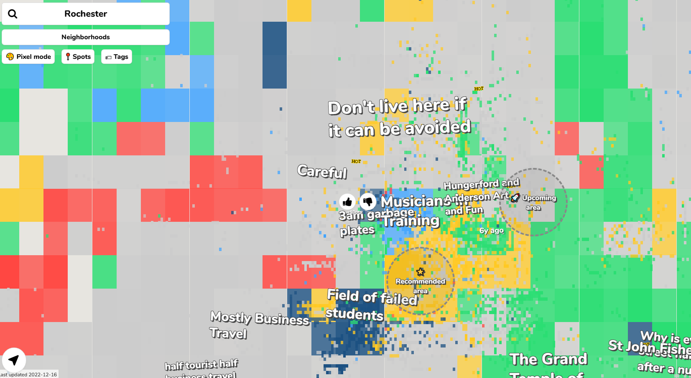
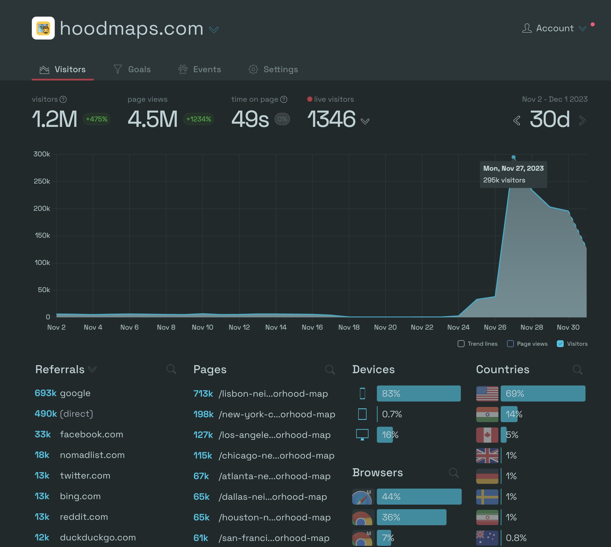

@levelsio published a website called hoodmaps.com

What can be said about a website like this?
How interesting it would be to train a model on the data as you see it in the image above.  No maps underneath, just zoning based on these catagories. What user data do we have for each tag?

The danger here is something to do with how quickly people from all over the world can be recruited to this seemingly innocuous task.  

What do you know when you have data like this for every major city in the world?
It's a higher level summary of a cityscape. It's the resolution of detail between a Google business page, a travel blog and an overhead street map.